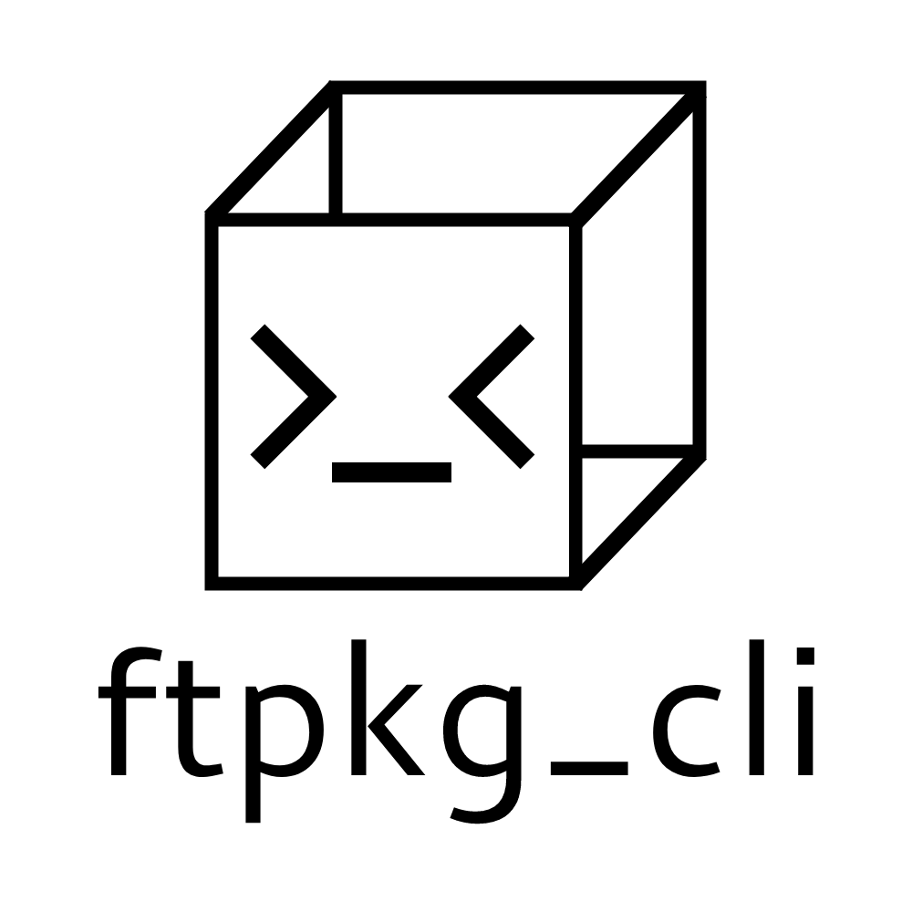
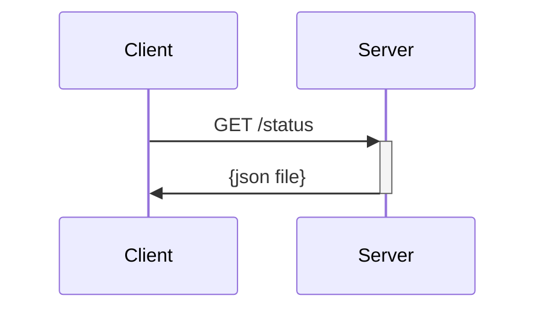
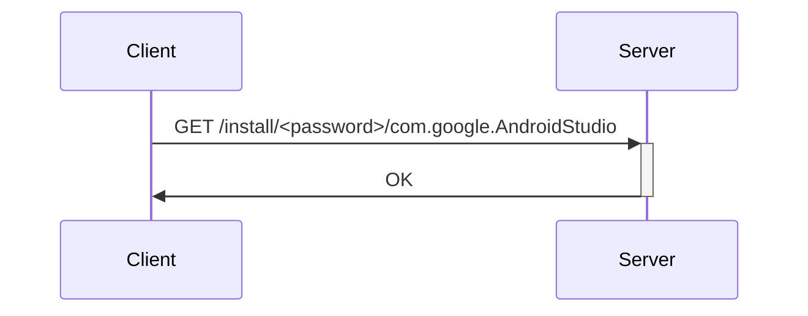

<p align="center">
  
</p>
<h2 align="center">
  Bash terminal utility for installing curated Flatpak packages by the 42 Paris team on 42 Paris dumps
  <p>
    
    
  </p>
</h2>

### Why this?

I have a startup script that automatically sets up dumps whenever I log into them - and that includes installing packages I use automatically. I'd like to make it easy for everyone to do the same thing. To be honest, most people just keep binaries around, but if we have a whole package manager at our hands, might as well use it!

### How do I use it?

Git clone the latest release and run it like this:
```
./ftpkg_cli
```

Here are all the options you can use:

```
$ ./ftpkg_cli
ftpkg_cli v0.3 - terminal utility for installing curated Flatpak packages by the 42 Paris team on 42 Paris dumps
Copyright (C) 2023 Denise BITCA
This program comes with ABSOLUTELY NO WARRANTY; This is free software, and you are welcome to redistribute it under certain conditions; see LICENSE file for more.

Usage: ftpkg_cli [OPTION]...
Formatting options (combining possible):
        --no-header                     Hide license header (default: false)
        --no-color                      Disable color output (default: false)
        --script-friendly               Stable formatting for usage in scripts (default: false)
General options (only one at a time):
        -q, --query                     Get list of available packages
        -i, --install <package_name>    Install package
        -u, --uninstall <package_name>  Uninstall package
Query options (for -q, --query):
        --installed                     Filter packages that are not installed (default: false)
Install/uninstall options (for -u, -i, --install, --uninstall):
        --password <password>           Password for the ftpkg server (default: none)
```

``./ftpkg_cli -q`` looks like this:
```
(...)
[not installed] eclipse JavaScript
        Package name: org.eclipse.Javascript
        Version: 0.15.1
        Description: The essential tools for any JavaScript developer, including JavaScript, TypeScript, HTML, CSS, XML, Yaml, Markdown languages support
[installed] Neovim
        Package name: io.neovim.nvim
        Version: 0.8.0
        Description: Vim-fork focused on extensibility and usability
[not installed] Ghidra
        Package name: org.ghidra_sre.Ghidra
        Version: 10.2.2
        Description: Ghidra Software Reverse Engineering Suite
[installed] Postman
        Package name: com.getpostman.Postman
(...)
```

For now, you will need the package name (in java format) in order to run install or uninstall operations.

### What password? ftpkg server? Huh?

The program automatically gets the password for you when running operations that require the password - don't think about it.

If you're on a Mac dump, it might be faster for you to keep the password somewhere and run the command with the password.

To obtain said password on a Dell dump:
```bash
cd cli_utils
docker build -q -t ftpkg:v0.3 ./docker
docker run -v "/usr/bin/ftpkg:/mnt/ftpkg" ftpkg:v0.3
```

To use the password on a Mac dump:
```
./ftpkg_cli --install <package name> --password <password>
```

### Are we allowed to use this on dumps?

I'm not sure - part of the process is literally reverse engineering an executable in order to obtain a hardcoded password. Guess we'll find out!

**___NOTE: DO NOT POST THE PASSWORD IN ISSUES OR LEAVE IT IN PULL REQUESTS___**

### How does it work?

ftpkg is composed of a client (the executable you run) and a server communicating via HTTP over TCP.

For example, here is how the ftpkg executable gets the list of packages that you can install/uninstall/update.



A package is usually formatted like this:

```json
{
  "name": "Android Studio",
  "package_name": "com.google.AndroidStudio",
  "category": "Development",
  "icon": "<app icon in base64>",
  "version": "2021.3.1.17",
  "description": "Integrated development environment for Google's Android platform",
  "state": "0"
}
```

Note: ``"state": "0"`` means "this package is not installed" and ``"state": "1"`` means "this package is installed".

Here is an example of what installing a program looks like:



The expected password is hardcoded inside the ftpkg executable.

### How do I contribute?

Feel free to drop an issue or a pull request, especially if you like using the Mac dumps (because I haven't tested this on them).
If your campus uses ftpkg and this doesn't work, you are more than encouraged to drop an issue.
